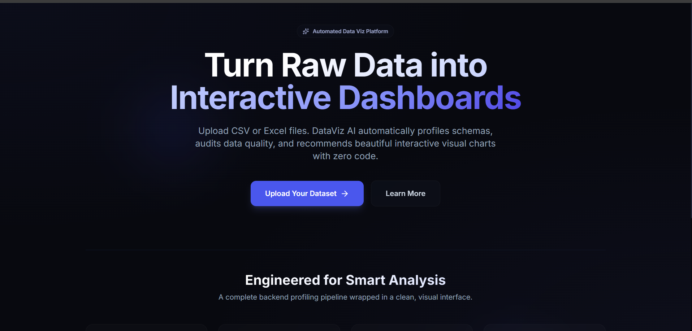
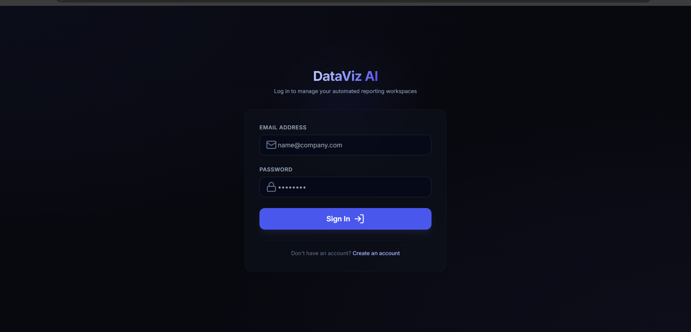
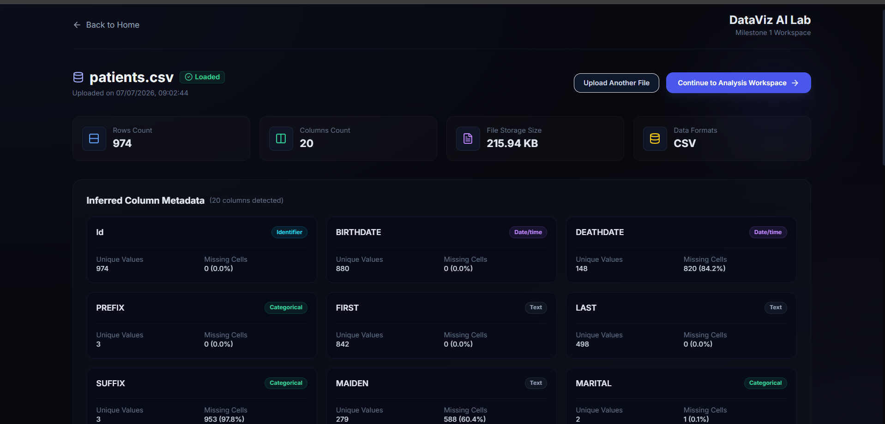
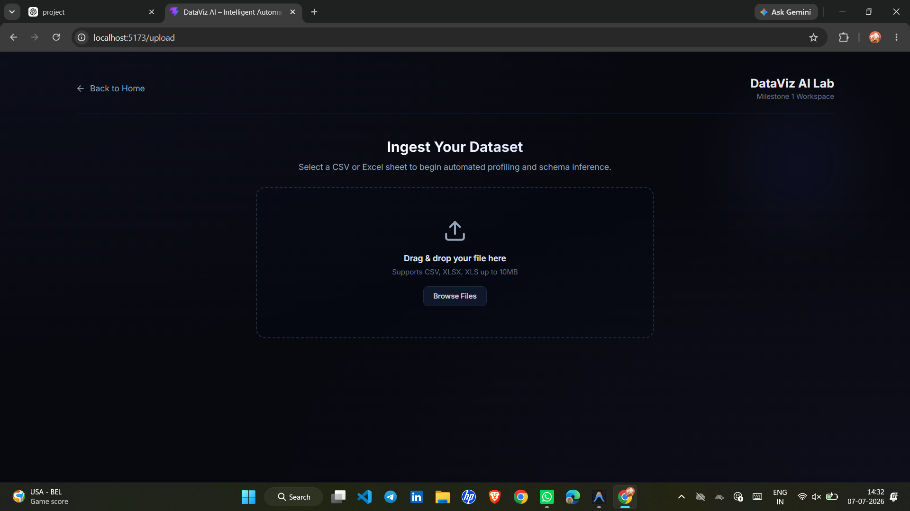
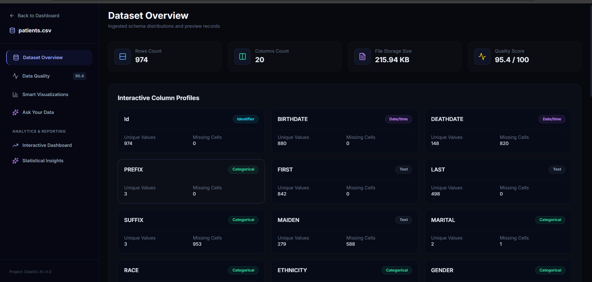
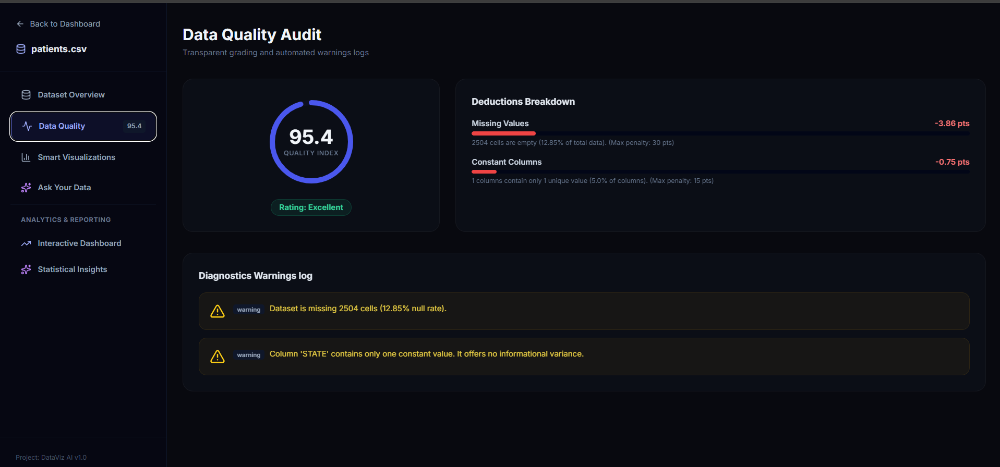
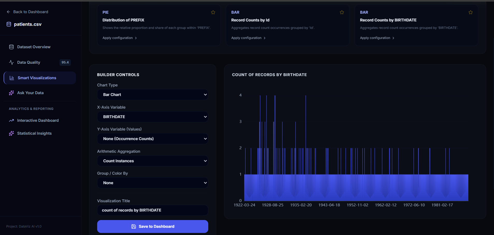
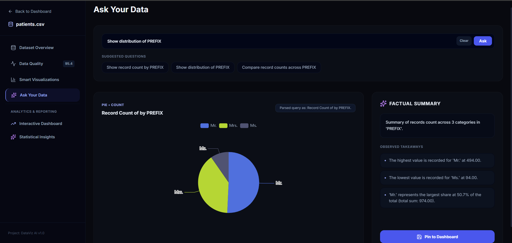
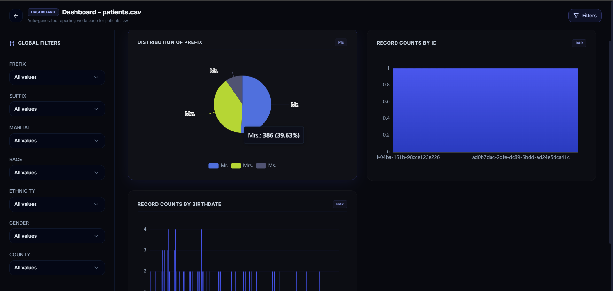
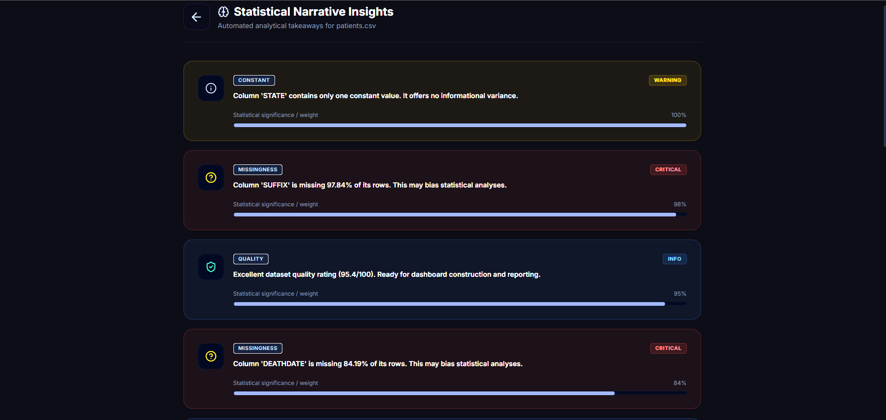

# DataViz AI Platform 📊🤖

DataViz AI is a full-stack automated data analysis and visualization platform that transforms CSV and Excel datasets into interactive analytical workspaces. Users can upload datasets, inspect schema and data-quality metrics, build custom visualizations, ask natural-language analytical questions, and pin useful charts to persistent dashboards.

The platform combines a React-based analytical interface with a FastAPI backend, Pandas-powered profiling and aggregation, secure dataset ownership controls, and deterministic natural-language query interpretation.

---

## 🏗️ Core Architecture & Flow

The application follows a decoupled client-server architecture:

```
┌────────────────────────────────┐
│      React Client (Vite)       │
│  - HSL Harmonious Design Mode  │
│  - ECharts Dynamic Graphics    │
└──────────────┬─────────────────┘
               │ HTTPS JSON APIs / Auth Tokens
               ▼
┌────────────────────────────────┐
│      FastAPI App Backend       │
│  - Deterministic NL Parser     │
│  - Pandas Profile Engine       │
└──────────────┬─────────────────┘
               │ SQLite ORM (SQLAlchemy)
               ▼
┌────────────────────────────────┐
│   SQLite Database + Storage    │
│  - Cascading Foreign Keys      │
│  - Sandbox File Store uploads/ │
└────────────────────────────────┘
```

1. **Authentication Flow**: Structured with JSON Web Tokens (JWT) using OAuth2 password flow, `passlib` bcrypt hashing, and SQLite user storage. Tokens are handled with strict local session states.
2. **Dataset Ingestion & Storage**: Safe upload sandbox generating randomized UUID filenames to prevent path traversals and name collisions.
3. **Profiling & Quality Engine**: Computes dataset dimensions, null rates, IQR statistical outliers, constant columns, duplicate rows, and formats type conflicts. Compiles an itemized quality score from 0-100.
4. **Smart Visualizer & ECharts**: Resolves custom aggregations (Sum, Average, Min, Max, Median, Count) via Pandas. Employs strong input type-checking to block invalid requests (e.g. non-numeric axes in Scatter Plots) directly at the source.
5. **Ask Your Data (NL Engine)**: Translates user questions deterministically into a structured chart configuration and aggregation queries, which are then summarized factually using `pandas` calculations.

---

## 🛠️ Technology Stack

* **Frontend**: React 19, Vite, Tailwind CSS, Lucide icons, React Router v7, Apache ECharts.
* **Backend**: Python 3.13, FastAPI, SQLAlchemy, SQLite, Pandas, NumPy, Pydantic, Passlib, Python-Jose, Pytest.

---

## 🚀 Getting Started & Startup Instructions

### Prerequisites
* Python 3.12+ / 3.13 installed
* Node.js v18+ installed

### Step 1: Clone and Environment Setup
```bash
# Clone the repository
git clone https://github.com/your-username/dataviz-ai.git
cd dataviz-ai
```

### Step 2: Backend Setup
```bash
cd backend

# Create virtual environment
python -m venv .venv
# Activate virtual environment
# On Windows PowerShell:
.venv\Scripts\Activate.ps1
# On macOS/Linux:
source .venv/bin/activate

# Install dependencies
pip install -r requirements.txt

# Create .env from template
copy .env.example .env  # Or copy manually
```

Configure your `.env` settings as needed. The database will automatically initialize SQLite schemas on first run.

### Step 3: Start Backend API Server
```bash
# From within the backend directory with active virtual environment:
uvicorn app.main:app --reload --port 8000
```
API docs will be available at `http://127.0.0.1:8000/docs`.

### Step 4: Frontend Setup
```bash
cd ../frontend

# Install node dependencies
npm install

# Run the client app locally
npm run dev
```
Open `http://localhost:5173` in your browser.

---

## 🧪 Running Automated Tests

DataViz AI utilizes Pytest for testing backend APIs and services. The tests validate auth lifecycles, dataset profiling, quality calculations, chart validations, and database cascade deletion.

```bash
# From the root directory:
$env:PYTHONPATH="."; backend\.venv\Scripts\pytest

# From within the backend folder:
$env:PYTHONPATH=".."; .venv\Scripts\pytest
```

---

## 🔒 Security & Reliability Implementations

* **SQLite Cascading Ref-Integrity**: Explicitly configures connection-level listener `PRAGMA foreign_keys=ON` to enforce dashboard/widget cleanup when parent datasets are deleted.
* **Input Isolation & Safe Paths**: Restricts uploads by suffix validation, using unique GUID storage paths, preventing filename traversal leaks.
* **Granular Owner Verification**: Endpoints explicitly evaluate `models.Dataset.user_id == current_user.id` to prevent cross-tenant dataset reads, dashboard modifications, or widget queries.
* **Aesthetic Quality Bounds**: Data quality progress bar widths dynamically compute against individual metric ceilings (not hardcoded sizes), aligning frontend UI values with backend engines.
* **Incomplete State Protection**: The frontend chart builder validates configuration models locally prior to calling query APIs, resetting mismatched options on chart type switches, ensuring no query compiler errors appear for normal incomplete choices.
---

## 📷 Screenshots & Application Flow

Follow the end-to-end user journey and interface flow of the DataViz AI platform:

### 1. Landing / Home Page

*The public landing page of the application introducing the platform's automated capabilities and directing users to start uploading their datasets.*

### 2. Login Page

*The secure authentication screen enabling registered users to access their personal workspaces and past datasets.*

### 3. Dataset Upload Page
#### User Workspace Dashboard

*The post-login workspace dashboard listing recent datasets with features to search, delete, or ingest new files.*

#### Drag-and-Drop Ingestion Portal

*The dedicated file ingestion interface supporting seamless drag-and-drop actions for CSV and Excel files up to 10MB.*

### 4. Upload Result / Dataset Profiling Page

*An immediate post-upload overview showing row counts, column counts, file size, and null rate statistics.*

### 5. Dataset Overview - Main Profiles

*Detailed visual statistics showing value distributions and data histograms for each uploaded attribute.*

### 6. Dataset Overview - Charts and Records Preview

*The active dataset preview workspace displaying the inferred column schemas, detected data types, and a preview table of the raw records.*

### 7. Data Quality Audit

*An explainable data quality scorecard from 0-100 detailing duplicate entries, missing elements, outliers, and automated cleanup advice.*

### 8. Smart Visualizations

*An automated visualization builder recommending customized ECharts based on columns type cardinality with manual tweak options.*

### 9. Ask Your Data

*The natural language query engine where users can type analytical questions to instantly compile chart configurations and factual summaries.*

### 10. Interactive Dashboard

*A persistent dashboard layout consolidating pinned widgets (bar, line, scatter charts) with global filters and responsive arrangements.*

### 11. Statistical Narrative Insights

*An automated analytical narrative reporting correlation matrix heatmaps, skewness takeaways, and statistical trends.*

---

## ⚠️ Known Limitations

* **SQLite Concurrency**: The system defaults to SQLite for simple local setups. Concurrency writes might trigger SQLite database lock exceptions. *Recommendation: Configure a dedicated PostgreSQL instance using the `DATABASE_URL` env variable for staging/production.*
* **Query Plot Cap limits**: Datapoints are capped at `1000` rows in query execution when aggregation is set to `none` to preserve client-side graphics performance.

---

## 🔮 Future Improvements

* **PostgreSQL Integration**: Complete migrations config for standard enterprise databases.
* **S3/Cloud Ingestion**: Add abstract cloud storage modules to handle file uploads rather than local directory writes.
* **Docker Containerization**: Add a `Dockerfile` and `docker-compose.yml` to spin up client and backend servers in single-command environments.
* **CI/CD Integration**: Configure GitHub Actions to automatically run backend tests and frontend builds on pull requests.

